<!--
  +---------------------------------------------------------------------+
  |  MANAS BOROLE - GitHub Profile README                               |
  +---------------------------------------------------------------------+
-->

> *You will not find a long commit history here. Most of my work lives in production codebases I do not have public access to, so this profile is a few things I built entirely on my own and actually shipped.*

<!-- ==============================  HERO  ============================== -->


<!-- Hero status cards. Plain table = fully editable, the cinematic frame lives in the assets around it. -->

|  ⟢ CURRENT MISSION  |  ⟢ LEARNING  |  ⟢ AVAILABLE FOR  |
|:---|:---|:---|
| Building an AI-powered workspace that helps teams collaborate and automate business operations. | Voice-native AI, real conversations at real latency. Distributed systems and routing LLMs on cost versus quality. | Hard problems. Ambitious products and AI systems. Work that ships. |

  <a href="https://manasos.vercel.app"><b>Portfolio</b></a> &nbsp;&#183;&nbsp;
  <a href="https://linkedin.com/in/manasborole"><b>LinkedIn</b></a> &nbsp;&#183;&nbsp;
  <a href="https://github.com/ManasBorole"><b>GitHub</b></a> &nbsp;&#183;&nbsp;
  <a href="mailto:manasborole0712@gmail.com"><b>Email</b></a>

<!-- ==============================  01 . MISSION  ============================== -->


<table>
<tr>
<td width="140" valign="top"></td>
<td valign="middle">

I work on the parts of a product that decide whether it feels effortless or falls apart under load: real-time voice, model routing, and the systems underneath them.

The tools matter less to me than two questions. Does it hold up in production, and does anyone reach for it twice.

Most of what I build starts as a hard problem someone actually has, and ends as something quiet enough that people stop noticing it is there.

</td>
</tr>
</table>


<!-- ==============================  02 . PHILOSOPHY  ============================== -->

<table>
<tr>
<td valign="top" width="50%">

**Ship it, or it is not real.**
A demo that never reaches a user is a nicer way of not finishing.

**Ask *why* before you build.**
The best people I have worked with question the problem before they touch the code.

**People over tech.**
The stack is a means. Whether anyone actually uses it is the metric.

</td>
<td valign="top" width="50%">

**Measure, then optimize.**
Guessing at bottlenecks is how you spend a week saving a millisecond.

**Small systems age well.**
Fewer moving parts, fewer 3am pages. Boring tech, ambitious product.

**Own the whole thing.**
From the founder years: scope, delivery, and the parts nobody wants to own.

</td>
</tr>
</table>


<!-- ==============================  03 . FEATURED PROJECTS  ============================== -->


 &nbsp; two live products, each its own landing page below

 

<!-- -- Multiplexer -- -->


<!-- Cover: a PNG renders reliably on GitHub and links to the live demo.
     For a true INLINE video, upload the .mp4 as a GitHub attachment and paste its
     github.com/user-attachments/assets/... URL on its own line here (see notes). -->
<video src="https://github.com/user-attachments/assets/b7ba15a4-9953-4809-a1cf-742aad85d560" poster="assets/projects/multiplexer-cover.png" controls muted loop playsinline width="100%">
<a href="https://multiplexer-routes.vercel.app">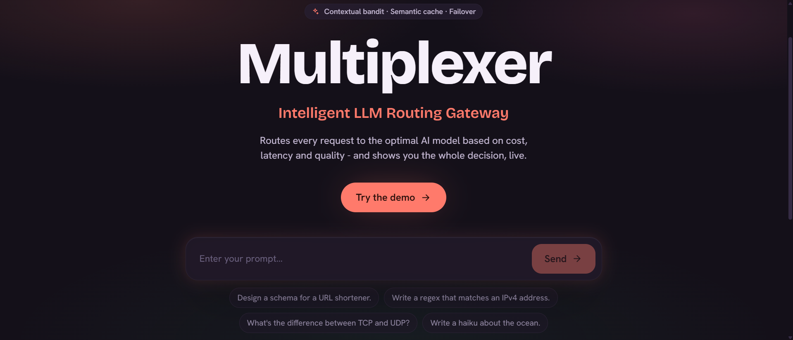</a>

**What it is.** An LLM gateway that learns, *per request*, which model to call. Instead of hard-wiring every call to one provider, it scores the incoming request and routes it to whichever model gives the best answer for the cost and latency you are willing to pay.

**How it works.** A LinUCB contextual bandit turns routing into an online-learning problem. Every response feeds latency, cost and quality back into the policy, so it gets sharper the more traffic it sees. A semantic cache short-circuits repeat questions, and a circuit breaker fails over when a provider degrades.

| | |
|---|---|
| **Stack** | TypeScript, Node, contextual bandits, semantic caching |
| **The hard part** | Making the reward signal honest. Routing is only as good as how you measure "better." |
| **What I learned** | Online learning earns its keep exactly where the right answer changes with price, load and prompt. |
| **Status** | 🟢 Live |

  <a href="https://multiplexer-routes.vercel.app"><b>▶ Live demo</b></a> &nbsp;&#183;&nbsp;
  <a href="https://github.com/ManasBorole/Multiplexer"><b>&lt;/&gt; Source</b></a>

<!-- -- Christopher -- -->


<!-- Cover: a PNG renders reliably on GitHub and links to the live demo.
     For a true INLINE video, upload the .mp4 as a GitHub attachment and paste its
     github.com/user-attachments/assets/... URL on its own line here (see notes). -->
<video src="Phttps://github.com/user-attachments/assets/e55e59c2-414e-442f-bcac-faf303a24627" poster="assets/projects/christopher-cover.png" controls muted loop playsinline width="100%">
<a href="https://christopherai.vercel.app">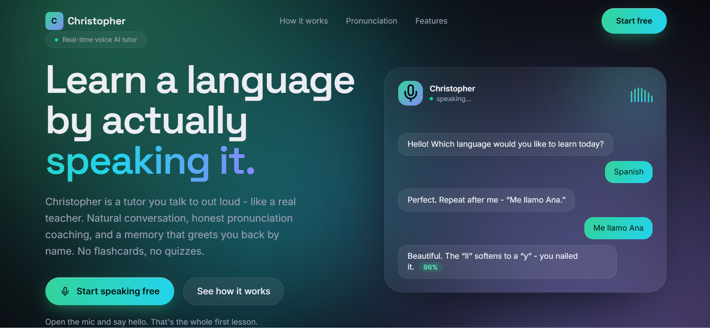</a>

**What it is.** A voice tutor you can actually talk to, out loud, in real time, in 180+ languages. It holds a live spoken conversation, remembers what you worked on last time, and scores your pronunciation as you go.

**How it works.** Audio streams over WebRTC into a speech-to-speech Realtime API for sub-second back-and-forth. A memory layer persists context across sessions so lessons build on each other instead of starting cold. Transcripts and pronunciation feedback come back live, mid-conversation.

| | |
|---|---|
| **Stack** | WebRTC, OpenAI Realtime API, persistent memory, React |
| **The hard part** | Latency. Anything over a beat and a spoken conversation stops feeling like one. |
| **What I learned** | Real-time voice is a systems problem long before it is an AI problem. |
| **Status** | 🟢 Live |

  <a href="https://christopherai.vercel.app"><b>▶ Live demo</b></a> &nbsp;&#183;&nbsp;
  <a href="https://github.com/ManasBorole/Christopher"><b>&lt;/&gt; Source</b></a>

<!-- -- Also built (grid) -- -->

ALSO IN THE HANGAR

<table>
<tr>
<td width="50%" align="center">
<a href="https://manasos.vercel.app">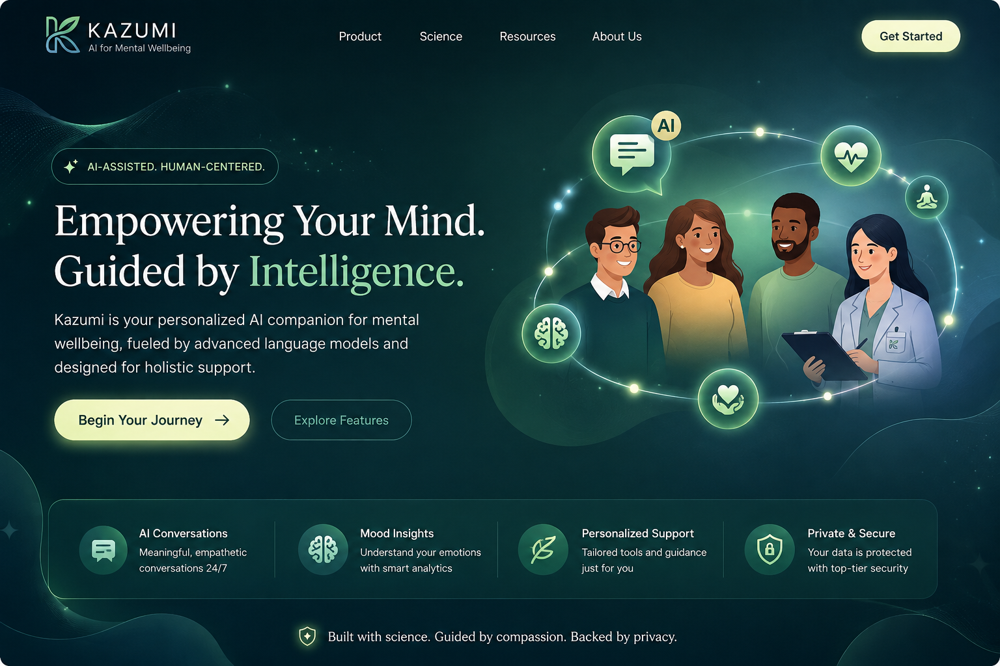</a> 
<b>Kazumi</b> - AI wellbeing platform. Led a five-person team as tech lead.
</td>
<td width="50%" align="center">
<a href="https://github.com/ManasBorole/CryptChain">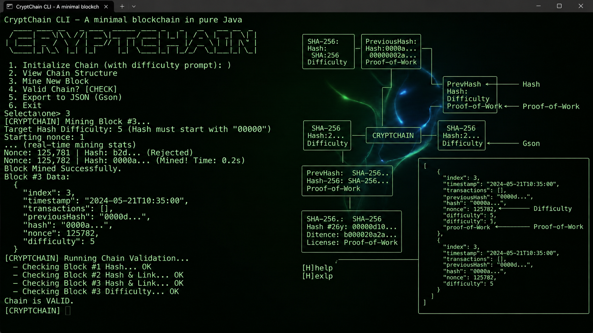</a> 
<b>CryptChain</b> - A blockchain in pure Java. SHA-256, proof-of-work mining, from scratch.
</td>
</tr>
<tr>
<td width="50%" align="center">
<a href="https://manasos.vercel.app">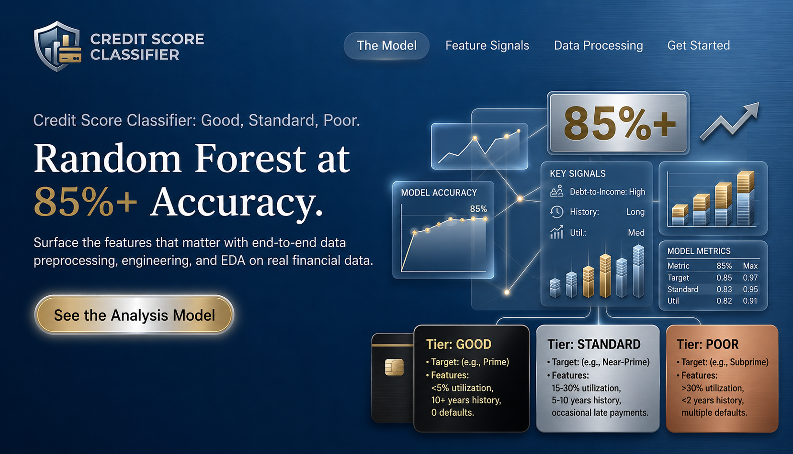</a> 
<b>Credit Score Classifier</b> - Random-forest model, 85%+ accuracy on credit tiers.
</td>
<td width="50%" align="center">
<a href="https://manasos.vercel.app">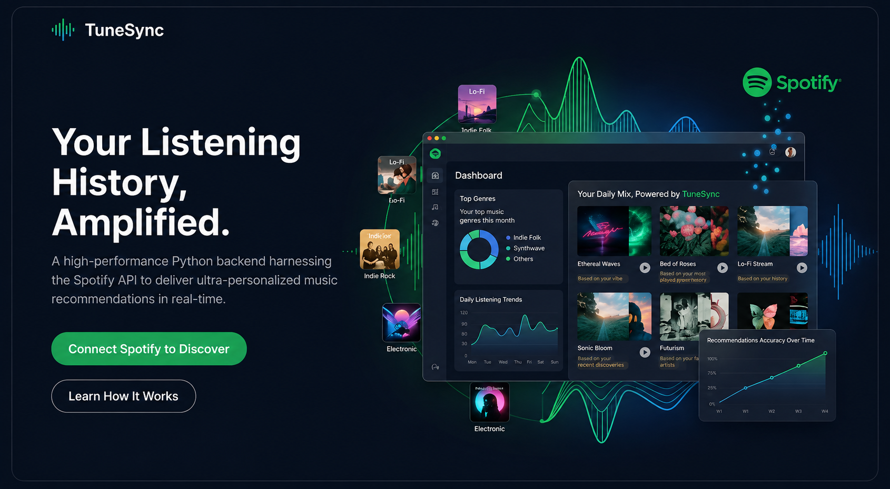</a> 
<b>Music Recommender</b> - Personalized picks over the Spotify API.
</td>
</tr>
</table>


<!-- ==============================  04 . ARCHITECTURE GALLERY  ============================== -->


**Multiplexer** - request in, scored across a model pool, best answer out, reward fed back into the policy. &#8594; <a href="https://github.com/ManasBorole/Multiplexer">source</a>

  


**Christopher** - audio over WebRTC into speech-to-speech, with memory that carries between sessions. &#8594; <a href="https://github.com/ManasBorole/Christopher">source</a>

<!-- ==============================  05 . TECH LABORATORY  ============================== -->

<table>
<tr>
<td width="50%"></td>
<td width="50%"></td>
</tr>
<tr>
<td width="50%"></td>
<td width="50%"></td>
</tr>
<tr>
<td width="50%"></td>
<td width="50%"></td>
</tr>
<tr>
<td width="50%"></td>
<td width="50%" valign="middle" align="center"> the tools change, the taste does not</td>
</tr>
</table>

<!-- ==============================  06 . CURRENT EXPERIMENTS  ============================== -->


**Live experiment: a team workspace with an operational agent.**
Collaboration and automation share one system. Every message carries a type, a decision or an action, so what a team agrees on becomes a durable record instead of scrolling away in a chat thread. On top of that record sits an embedded agent that works across business tools such as HubSpot and Xero. Ask it to raise a purchase order and it checks inventory and budget, flags risks like a supplier delay or a cash-flow gap, waits for human approval, then executes and logs the outcome. Every step stays traceable.

<!-- ==============================  07 . TIMELINE  ============================== -->


<!-- ==============================  08 . INTERACTIVE TERMINAL  ============================== -->

<!-- ==============================  09 . PRINCIPLES  ============================== -->

<!-- ==============================  10 . CONTACT  ============================== -->


<table>
<tr>
<td width="140" align="center" valign="middle"></td>
<td valign="middle">

If you are building something, stuck on a hard problem, or just want to talk about where AI is actually useful, say hi. Some of the best things I have done started from a random conversation.

<a href="mailto:manasborole0712@gmail.com"><b>Email</b></a> &nbsp;&#183;&nbsp;
<a href="https://linkedin.com/in/manasborole"><b>LinkedIn</b></a> &nbsp;&#183;&nbsp;
<a href="https://github.com/ManasBorole"><b>GitHub</b></a> &nbsp;&#183;&nbsp;
<a href="https://manasos.vercel.app"><b>Portfolio</b></a>

</td>
</tr>
</table>

<!-- ==============================  ENDING SCENE  ============================== -->

